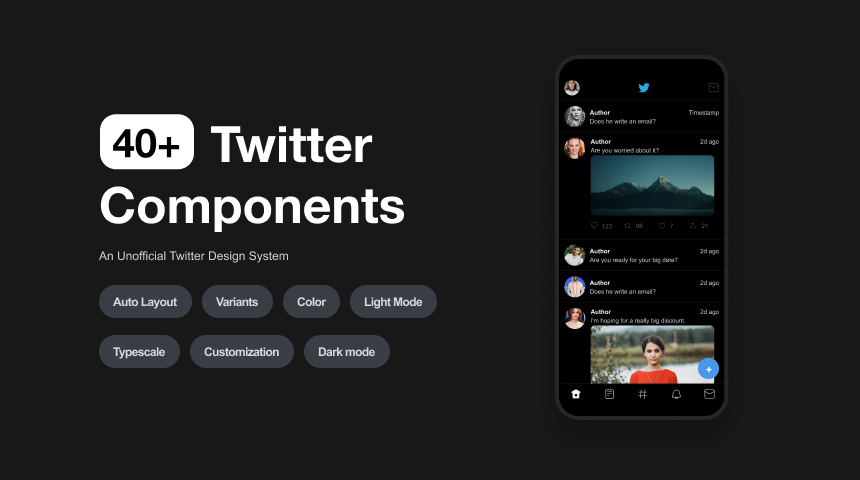

# twitter_ui_kit

A new Flutter project.

 

## ✨ Requirements

- Any Operating System (ie. MacOS X, Linux, Windows)
- Any IDE with Flutter SDK installed (ie. IntelliJ, Android Studio, VSCode etc)
- A little knowledge of Dart and Flutter
- A brain to think 🤓🤓

 

## build apk
flutter build apk

## 📸 Banner

 

## 🤓 Design Credit

**Alex Lakas**
(https://www.alexlakas.com/)

## 🤓 Author

**Bukunmi Aluko**
(https://www.linkedin.com/in/bukunmi-aluko)

 

## 😃 Show some love ❤️😍😍

Leave a 🌟

Follow for update. 😃

[comment]: <> (## Development version :hammer:)

[comment]: <> (- [APK &#40;direct download&#41;]&#40;https://github.com/bukunmialuko/flutter_ui_kit_obkm/releases/download/v1.0.1/app-release.apk&#41;)

